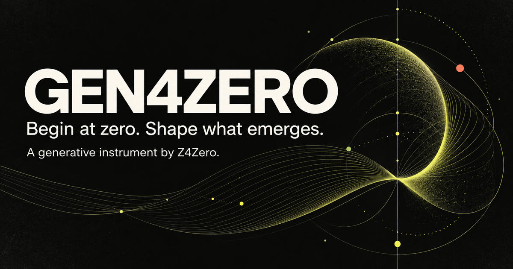

# Gen4Zero

> Begin at zero. Shape what emerges.

An open, browser-native generative instrument for shaping visual systems from seed to form.

[Open Gen4Zero](https://zzao.im/gen4zero/) · [Share feedback](https://github.com/hominthesky/gen4zero/issues/new/choose)

The launch is available at the project URL above. The planned canonical origin, `gen4zero.zzao.im`, is awaiting DNS setup; it is not yet advertised as a working address.



## What it includes

- Six deterministic systems: vector field, orbital bloom, cellular veil, recursive grid, moiré signal, and particle loom.
- Reproducible seeds plus controls for density, complexity, motion, continuity, scale, weight, and grain.
- A second generative layer with blend modes for composing systems rather than choosing only one pattern.
- Output presets for web heroes, Full HD, vertical video, portrait and square feeds, social cards, and A-series posters.
- PNG export, five-second WebM recording, portable JSON recipes, and shareable recipe URLs.
- A curated public Gallery and a separate, local-only collection stored in the browser.
- No account, analytics, upload, server runtime, or build dependency.

## Run locally

```bash
npm run dev
```

Then open `http://localhost:4173`.

## Project structure

```text
index.html          Interface and metadata
styles.css          Visual system and responsive layout
app.js              Renderers, recipes, gallery, and export logic
docs/PRODUCT.md     Product model and roadmap
tests/              Dependency-free checks
.github/workflows/  GitHub Pages deployment
```

## Make it your own

The quickest extension points are the `patterns`, `palettes`, `presets`, and `curatedWorks` objects in `app.js`. A renderer receives a canvas context, dimensions, a normalized recipe, time, and whether it is being used as a secondary layer.

Artwork recipes are plain JSON. This makes a visual result reviewable, versionable, and remixable without shipping a raster source file.

## Engineering loop

Gen4Zero uses a risk-graded loop for human and agent contributions. Every change moves through scope, implementation, deterministic checks, visual review when relevant, an inspectable pull request, deployment, and live verification. Start with [`AGENTS.md`](./AGENTS.md) and [`docs/ENGINEERING.md`](./docs/ENGINEERING.md).

Run the same release gate used by GitHub Actions:

```bash
npm run verify:release
```

## Publish

The included workflow verifies and deploys only the seven-file `dist/` allowlist to GitHub Pages on pushes to `main`. Before the first run, choose **GitHub Actions** as the repository's Pages source. Repository documents and tests are not in the website artifact.

Recommended URL strategy:

1. Use this as a standalone repository named `gen4zero`.
2. Publish at the default project URL first.
3. Configure `gen4zero.zzao.im` as the repository's custom domain.
4. Point the DNS `CNAME` for `gen4zero` to `hominthesky.github.io` and enforce HTTPS after GitHub issues the certificate.

The repository includes a `CNAME` file as an origin contract for verification. With an Actions-based deployment, GitHub ignores that file: the custom domain must also be set in Pages settings before pointing DNS at GitHub. See [GitHub's custom-domain guide](https://docs.github.com/en/pages/configuring-a-custom-domain-for-your-github-pages-site/managing-a-custom-domain-for-your-github-pages-site).

## Browser acceptance and current limits

PNG uses the exact selected dimensions. WebM records the preview canvas (capped near 2.2 megapixels), with its actual dimensions shown in the output panel. Clips are approximately five seconds, are not seamless loops, and animation speed/recording quality depend on browser performance. MP4 and mobile-browser parity are not promised in v0.1.

For repeatable real-browser acceptance, install Playwright in your development environment and run `node scripts/browser-smoke.mjs` against the local server. `SITE_URL` selects another deployed origin; `PLAYWRIGHT_MODULE` and `CHROME_PATH` optionally select existing local installations. The script uses an isolated browser context and temporary evidence files, checking renderers, PNG dimensions, decodable WebM, Gallery persistence, recipe round-trips, page errors, and narrow-screen overflow. This optional browser test is separate from the dependency-free CI gate; visual screenshots still need human inspection.

## License

[MIT](./LICENSE) for the software. Curated artwork authorship remains attributed to Z4Zero unless a contribution says otherwise; the software license does not automatically grant rights to individual gallery works or brand marks.
